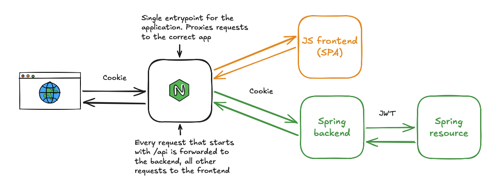

# Spring Security JWT Starter

A starter project for learning web security with Spring Boot. It demonstrates cookie-based session authentication for a Single Page Application (SPA) and JWT-based authentication for a backend resource server — all unified under one origin via an nginx reverse proxy.

## Architecture



### Components

| Component | Description |
|-----------|-------------|
| **nginx** | Reverse proxy. Serves the static SPA and forwards backend paths to the BFF, making everything appear as the same origin (`localhost:80`). |
| **BFF** (Backend for Frontend) | Spring Boot app on port `8080`. Handles form login, session cookies and CSRF protection (SPA-mode). After login it can issue JWTs (RSA-signed) and call the Resource server on behalf of the user. |
| **Resource server** | Spring Boot app on port `8081`. Exposes `/api/protected` and validates incoming JWT Bearer tokens using the BFF's public JWK set (`/.well-known/jwks.json`). |
| **Frontend** | Vanilla JS SPA served by nginx. Talks only to the BFF via the same origin — no CORS needed. |

## Running the project

### 1. Start nginx + frontend

```bash
docker compose up
```

The SPA is now available at [http://localhost](http://localhost).

### 2. Start the BFF

```bash
cd bff
./mvnw spring-boot:run
```

### 3. Start the Resource server

```bash
cd resource
./mvnw spring-boot:run
```

## Key endpoints

| Method | Path | Description |
|--------|------|-------------|
| `POST` | `/api/login` | Form login — sets session cookie |
| `POST` | `/api/logout` | Clears session |
| `GET`  | `/api/protected` | Protected resource (requires valid JWT) |
| `GET`  | `/.well-known/jwks.json` | BFF's public RSA key (used by Resource server) |

## Default credentials

| Username | Password | Role |
|----------|----------|------|
| `user` | `pw` | USER |
| `admin` | `pw` | ADMIN |

## Learning goals

- Cookie-based session authentication for SPAs (no tokens in the browser)
- CSRF protection in SPA mode
- RSA-signed JWT generation and validation
- Securing a separate resource server with JWTs fetched from a JWK Set endpoint
- Nginx as a same-origin reverse proxy to avoid CORS

